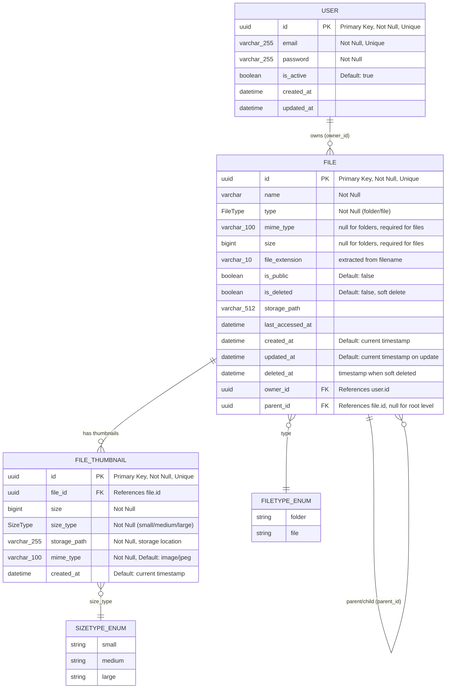

# **File Manager**  
*A secure, scalable file management system built with Spring Boot, PostgreSQL, and Docker*

  
  
  
  

---

## **🚀 Features**  
- **User Authentication**  
  - JWT-based secure login/logout (24h token validity)  
  - Role-based access control (Admin/User)  
- **File Management**  
  - Upload, organize, and preview files (images, documents)  
  - Public/private visibility toggle  
  - Automatic thumbnail generation for images (100px, 250px, 500px)  
- **Scalable Architecture**  
  - Redis caching for sessions  
  - Asynchronous background jobs (thumbnails, emails)  
- **DevOps-Ready**  
  - Dockerized PostgreSQL + Redis  
  - Multi-stage Docker builds (Corretto 21 + Alpine)  

---

## **🛠 Tech Stack**  
| Component       | Technology              |  
|-----------------|-------------------------|  
| **Backend**     | Spring Boot 3.2, Java 21 (Corretto) |  
| **Database**    | PostgreSQL 15           |  
| **Cache**       | Redis 7                 |  
| **Auth**        | JWT, Spring Security    |  
| **Storage**     | Local filesystem (configurable to S3) |  
| **DevOps**      | Docker, Docker Compose  |  

---

## **⚡ Quick Start**  

### **Prerequisites**  
- Docker Engine 24+  
- Java 21 (Amazon Corretto)  
- Maven 3.9+  

### **1. Clone & Setup**  
```bash  
git clone https://github.com/codemindshub/files-manager.git  
cd files-manager  
cp .env.example .env  # Update values in `.env`  
```  

### **2. Start Database & Redis**
```bash  
docker compose up -d  # Starts Postgres and Redis  
```  

### **3. Access PostgreSQL (Optional)**
```bash  
docker exec -it postgres-fm bash  
psql -U files-manager -d files_manager_db  # Connect to DB  
```  

### **4. Run the Application**
```bash  
mvn spring-boot:run  # Starts Spring Boot on http://localhost:8080  
```  

---

## **📂 Project Structure**
```  
files-manager/  
├── .dockerignore  
├── .env                          # SECRETS (Gitignored)  
├── .env.example                  # Template for team  
├── docker-compose.yml            # Docker setup (Postgres + Redis)  
├── src/  
│   ├── main/  
│   │   ├── java/gtp/filesmanager/  
│   │   │   ├── config/           # Spring config classes  
│   │   │   ├── controller/       # REST endpoints  
│   │   │   ├── dto/              # Request/response objects  
│   │   │   ├── exception/        # Custom exceptions 
│   │   │   ├── job/              # background jobs
│   │   │   ├── logging/          # logging configs  
│   │   │   ├── model/            #  
│   │   │   ├── repository/       #
│   │   │   ├── service/          # Business logic  
│   │   │   └── util/             # Helper classes  
│   │   └── resources/  
│   │       ├── db/               # SQL scripts  
│   │       └── application.properties
└── test/                         # Unit + integration tests  
```  

---

## **🔒 Environment Variables**
| Key                     | Purpose                           |  
|-------------------------|-----------------------------------|  
| `POSTGRES_USER`         | Database user                     |  
| `POSTGRES_PASSWORD`     | Database password                 |  
| `POSTGRES_DB`           | Database name                     |  
---


## **📜 License**
MIT © 2024 CodeMinds

---

## **💡 Future Roadmap**
- [ ] Cloud storage (S3/GCS) integration
- [ ] File versioning
- [ ] Real-time notifications (WebSocket)

--- 

✨ **Happy Coding!** ✨
```
